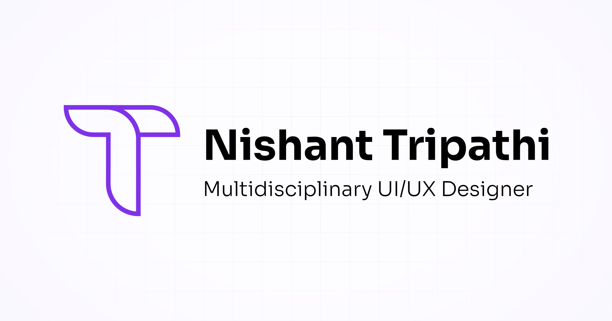

  

  

    
    
    
    
  

## Hi, I'm Nishant 👋

> A multidisciplinary designer with a passion for excellence, an obsession to drive lasting impact, and a positive state of mind :)

I design digital experiences that drive growth: UI/UX, brand systems, and web across e-commerce, higher ed, and enterprise. I lead the design practice at **[Sumeru](https://nishantt.com/work/sumeru)**, a 600+ person consulting firm, and I build AI into every step of how I work. The chat on my portfolio even runs on a language model I host myself, on an old gaming laptop. That is the kind of designer I am.

- 🎓 &nbsp; BFA in Design from **USC**, minor in Computer Programming. Summa Cum Laude, Renaissance Scholar.
- 🏆 &nbsp; 2025 **Web Excellence Award**, and **Top Rated Plus** on Upwork (4.97 / 5.0 across 30+ clients).
- 🎮 &nbsp; Shipped UI for **Marvel's Wolverine** at Insomniac Games.
- 🌍 &nbsp; 40+ clients worldwide, 50M+ users impacted, and most of them keep coming back.
- 📍 &nbsp; Based in Los Angeles, comfortable working across every US timezone.

## 🧰 Toolbox

**Design**

**Build**

**AI &amp; Data**

## 📌 Featured projects

- **[moksha-solo-game](https://github.com/Trippyy/moksha-solo-game)** &nbsp;·&nbsp; A 2D top-down pixel RPG set inside the human mind, where every enemy is an emotion. My solo BFA thesis, built in Unity. [Play it on itch.io ↗](https://nishantrippy.itch.io/moksha)
- **[interactive-motorsport-presentation](https://github.com/Trippyy/interactive-motorsport-presentation)** &nbsp;·&nbsp; Autodromo California × McLaren, a web-native interactive slide deck built with Vite, GSAP, Lenis, and Three.js.
- **[nishantt.com](https://nishantt.com)** &nbsp;·&nbsp; My portfolio, with three ways to explore: a guided story, an AI chat running on a model I self-host, and the traditional work.

## ✨ Off the clock

Vector illustration and 3D character art, a blue Yamaha R3, and the great outdoors.

---

**Got a problem worth solving?**

